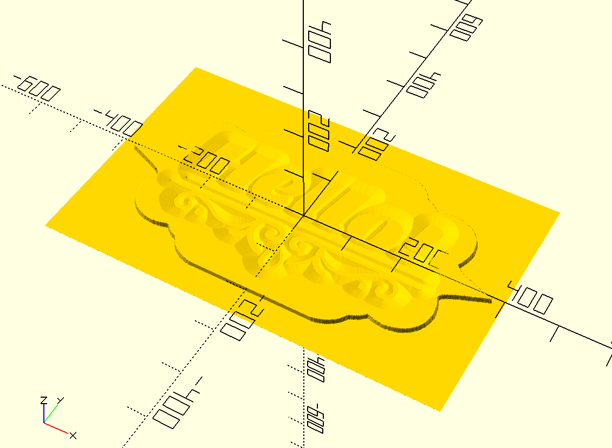
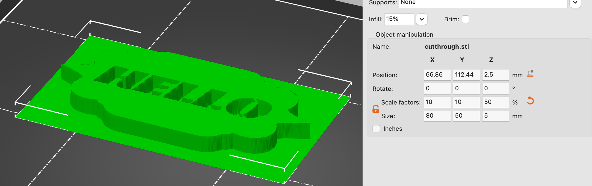
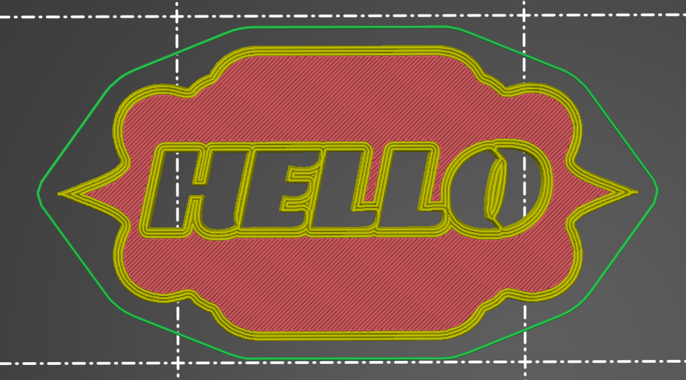
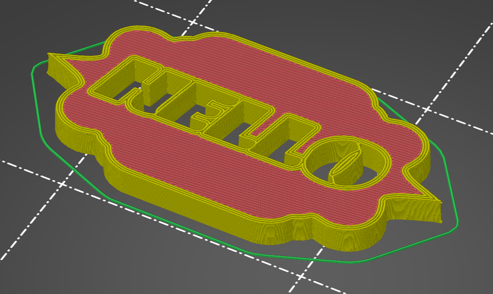
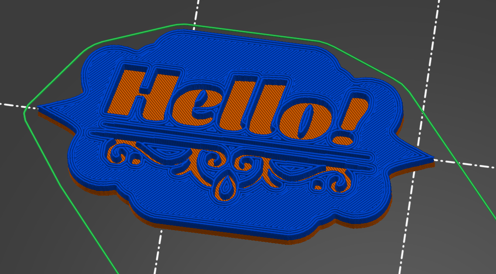
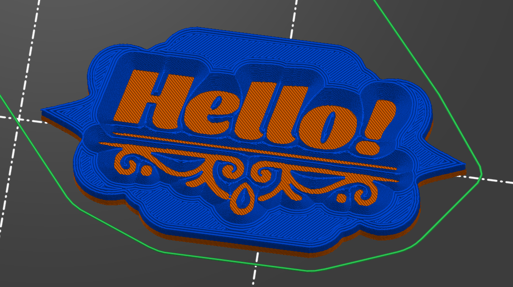

# Designing 3D Models in Photoshop

Since having a 3D printer, a common item I want to design and print are custom plaques, tags, and signs. Using traditional 3D modeling software works for this, but it's tedious to create really good looking designs. It's especially hard to iterate/tweak a "graphic" design in CAD software.

So I developed a workflow that's worked really well for me where I instead design a greyscale 2D image with image editing software, and use OpenSCAD to convert it into a 3D model for me to print. I've not seen this specific method documented very well online, so I thought I'd put together a little blog post detailing how it works.

This method is inspired by those [sites that make a lithoplane STL out of an image you upload](https://lithophanemaker.com). I originally tried using these sites but ran into so many issues getting exactly what I wanted.

## The Strategy

The goal is create a thin print with images/text/logos "cut" out of the piece. We do this by creating a greyscale 2D image of the design, then using this image as a height-map to generate a 3d model (via the [surface](https://files.openscad.org/examples/Basics/surface.html) function). This can work for both fully cut-through designs, or two-tone designs by swapping out the filliment half way through the print.

## Design

You can use any software you want to design the 2D image. I like [Photopea](https://www.photopea.com), which is a free Photoshop alternative. A fully cut through design is easy, make any fully black-and-white photo you want. But with this style, you need to follow stencil logic such that the black portion of your image is a single continuous body (resulting in a single object being printed).


But if you'd like a more complex shape, and avoid those stencil lines (and get a sturdier piece), you can design a two-tone image, like so. The grey can be printed with one color filliment, the black another. 


Depending on the depth of your piece, you can also bevel the edges to make the piece more readable from more angles - do this using `Precise` glows (not `Softer`).


Once we extrude a 3d model, this will make more sense.

### Modeling

Once we have our image saved, we can head over to OpenSCAD to create the model. We'll use the [surface](https://files.openscad.org/examples/Basics/surface.html) function in OpenSCAD to treat the image like a height map:

- White pixels `#ffffff` will be consider a height of `0`
- Black pixels `#000000` will be considered a height of `1`
- Greys will be somewhere in between, `#808080` is `0.5`

> PS: I like `invert=true` because the black portion being what I print is more intuitive to me.

The one caveat here is that `0` height portions of the image will still be drawn in the preview - but once brought into a slicer the `0` height will be ignored. Here's an example OpenSCAD script:
```
src="/some-dir/src-2tone-grad.png";
surface(file = src, center = true, convexity = 5, invert=true);
```

This will result in a model that is 800mm x 500mm with a height of 100mm (the black pixel height). I normally scale this in my slicer, as scaling it in OpenSCAD takes ***FOREVER***.



You can do this in the UI, but the preview window with the `surface` function can get really laggy. So I often use the CLI. To create a preview image:
```
/Applications/OpenSCAD.app/Contents/MacOS/OpenSCAD -o preview.png model.scad
```

Then to render an STL:

```
/Applications/OpenSCAD.app/Contents/MacOS/OpenSCAD -o render.stl model.scad
```

### Slicing

I have a Prusa Mini, so I'm only familiar with the Prusa Slicer. Once the model is imported, I can adjust the dimensions to what I want, in this case, I'm slicing 80mmx50mm with a height of 5mm.



Then we slice! Here's the cut-through example:



Looks great! But from the side (or back) it's difficult to read. Also, that O looks fragile.



Using the straight-up 2-tone helps though, plus makes it so you can't even see the design from the back, and we don't need to worry about the flow!



But my favorite option is using the outer glow in the source image to make a bevel. It is the most readable from all angles, and looks great.



There you go!