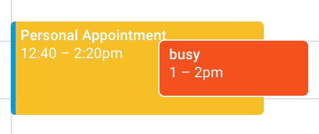

# Personal Calander Sync

In my career, I've mostly used Google Calendar at work. I also use multiple Google calendars for personal events (personal, shared, family, etc.). I can share these calendars with my work account, but my personal events do not show up as "Busy" to my coworkers. So I often have to invite my work account too all of my events, or manually create duplicate "Busy" events in my work calendar.

Then I found [this article](https://janelloi.com/auto-sync-google-calendar/). Which links to this [Google Apps Script](https://gist.github.com/ttrahan/a88febc0538315b05346f4e3b35997f2). The process is exactly right, but the script I changed to support some more options.

## Goal

The goal is to automaticlaly create (and delete) busy blocks in my work calendar, with some time buffer to account for travel/context switching. Here's an example:



The 1-2p event is from my personal calendar, as seen from my work account. The sync scrips has automatically creates a 12:40-2:20p event in my work calendar blocking it off from meeting invites.

## Process

This process is an abreviated version of [this article](https://janelloi.com/auto-sync-google-calendar/). The only difference is the mention of multi-calendar support and different parameters to change.

1. Share your personal calendars with your work account (no need to share event details)
2. Get the Calendar ID for each of them (you can find them in the "settings" of the calander, by the "Share" section)
3. Create a new [Google Apps Script](https://script.google.com/home/projects/create), and include [this source code](#script), updating the paramaters as desired:
   - Set your external calendar IDs
   - Set your buffer time (20 minutes means that a 8a-9a event will create a 7:40a-9:20a block in your work calander)
   - Update your event details visibility, color, and title
   - Configure how many days you want the script to look ahead (4 weeks by default)
4. You can then run the scipt manually to sync and verify it works.
5. Then head to the "Triggers" section of your project. For each calendar you're syncing from, setup a new trigger to call the `sync` function. Source it from a calendar whenver it is updated. Use the same calendar IDs you added to your script parameters.

That's it, all done!

## Script

Here is my version of the script:

```javascript
function sync() {
  var secondaryCalIds = [];
  secondaryCalIds.push("your@email.com");
  secondaryCalIds.push("c_32523rewsf43v345v54b54b454@group.calendar.google.com");
  var primaryEventTitle = "Personal Appointment";
  var eventBufferMinutes = 20;
  var eventBufferMs = eventBufferMinutes * 60 * 1000;
  var visiblity = CalendarApp.Visibility.PUBLIC;
  var color = CalendarApp.EventColor.YELLOW;

  var today = new Date();
  var endDate = new Date();
  endDate.setDate(today.getDate() + 28); // how many days in advance to monitor and block off time
  var secondaryEvents = [];
  for (cid in secondaryCalIds) {
    var secondaryCal = CalendarApp.getCalendarById(secondaryCalIds[cid]);
    var srcEvents = secondaryCal.getEvents(today, endDate)
    var secondaryEvents = secondaryEvents.concat(srcEvents);
    Logger.log('Number of source events: ' + srcEvents.length + ' (' + secondaryCalIds[cid] + ')');
  }

  // create filtered list of existing primary calendar events that were previously created from the secondary calendar
  var primaryCal = CalendarApp.getDefaultCalendar();
  var primaryEventsAll = primaryCal.getEvents(today, endDate); // all primary calendar events
  var primaryEvents = []; // to contain primary calendar events that were previously created from secondary calendar
  for (pev in primaryEventsAll) {
    var primaryEvent = primaryEventsAll[pev];
    if (primaryEvent.getTitle() == primaryEventTitle) {
      primaryEvents.push(primaryEvent);
    }
  }
  Logger.log('Total number of target events: ' + primaryEventsAll.length);
  Logger.log('Number of managed target events: ' + primaryEvents.length);

  // process all events in secondary calendar
  var statsCreated = 0, statsDeleted = 0;
  var updatedPrimaryEventIds = []; // to contain primary calendar events that were updated from secondary calendar
  for (sev in secondaryEvents) {
    secondaryEvent = secondaryEvents[sev];

    // include buffer around personal appoint (i.e. travel time)
    var secondaryStart = new Date(secondaryEvent.getStartTime().getTime() - eventBufferMs);
    var secondaryEnd = new Date(secondaryEvent.getEndTime().getTime() + eventBufferMs);

    // if the secondary event has already been blocked in the primary calendar, update it
    updated = false;
    for (existingId in primaryEvents) {
      var primaryEvent = primaryEvents[existingId];
      if ((primaryEvent.getStartTime().getTime() == secondaryStart.getTime()) && (primaryEvent.getEndTime().getTime() == secondaryEnd.getTime())) {
        primaryEvent.setDescription(secondaryEvent.getTitle() + '\n\n' + secondaryEvent.getDescription());
        primaryEvent.setVisibility(visiblity);
        primaryEvent.setColor(color);
        updatedPrimaryEventIds.push(primaryEvent.getId());
        Logger.log('EVENT UPDATED - id: ' + primaryEvent.getId() + ' (' + secondaryEvent.getTitle() + ')');
        updated = true;
        break;
      }
    }
    if(updated) {
      continue;
    }

    // skip all day, multi-day, or weekend events
    var startDay = secondaryEvent.getStartTime().getDay();
    var endDay = secondaryEvent.getEndTime().getDay();
    if(secondaryEvent.isAllDayEvent() /*|| startDay != endDay */|| startDay == 0 || startDay == 6) {
      continue;
    }

    // create a new event based on the secondary event
    var newEvent = primaryCal.createEvent(primaryEventTitle, secondaryStart, secondaryEnd, {description:secondaryEvent.getTitle() + '\n\n' + secondaryEvent.getDescription()});
    newEvent.setVisibility(visiblity);
    newEvent.setColor(color);
    newEvent.removeAllReminders();
    statsCreated = statsCreated + 1;
    Logger.log('EVENT CREATED - id: ' + newEvent.getId() + ' (' + secondaryEvent.getTitle() + ')');
  }

  // if a primary event previously created no longer exists in the secondary calendar, delete it
  for (pev in primaryEvents) {
    if (updatedPrimaryEventIds.indexOf(primaryEvents[pev].getId()) == -1) {
      var pevIdToDelete = primaryEvents[pev].getId();
      Logger.log(pevIdToDelete + ' deleted');
    Logger.log('EVENT DELETED - id: ' + pevIdToDelete + '');
      statsDeleted = statsDeleted + 1;
    }
  }

  Logger.log('Events created: ' + statsCreated);
  Logger.log('Events updated: ' + updatedPrimaryEventIds.length);
  Logger.log('Events deleted: ' + statsDeleted);
}
```

